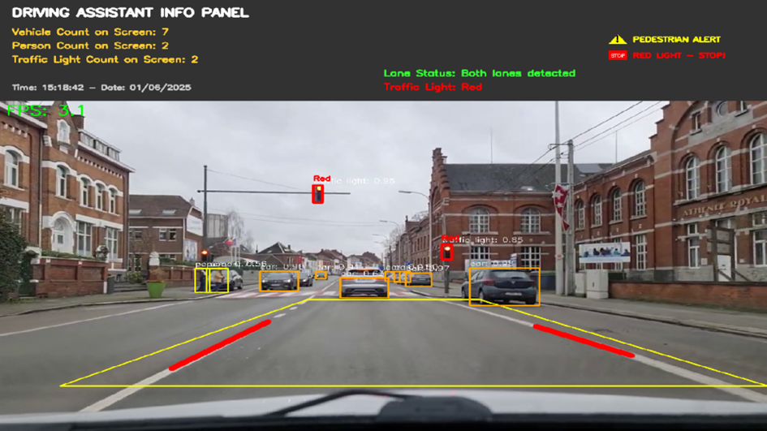

# 📹 Dashcam Video Analysis System

> A computer vision prototype utilizing **YOLOv3** and **OpenCV** to analyze pre-recorded dashcam footage for lane tracking, object detection, and traffic light classification.

## 📝 Project Overview

This project was developed as a final assignment for the Image Processing course. It demonstrates how classic computer vision techniques can be combined with deep learning to create a driving assistance analysis tool.

**Note:** This system uses a **fixed Region of Interest (ROI)** and is optimized for specific dashcam video resolutions. It serves as a proof-of-concept for video analysis rather than an autonomous driving system.

## 🌟 Key Features

The system processes video frames through a pipeline combining multiple technologies:

* **Object Detection (YOLOv3):**
    * Utilizes the YOLOv3 model to detect objects such as **cars**, **pedestrians**, and **traffic lights** with high accuracy.
    * Includes Non-Maximum Suppression (NMS) to filter overlapping bounding boxes.

* **Lane Detection (OpenCV):**
    * Defines a polygon-based **fixed ROI (Region of Interest)** to focus on the road surface.
    * Applies **Canny Edge Detection** and **Hough Line Transform** to identify lane markings.
    * Classifies lines as "Left" or "Right" based on slope analysis.

* **Traffic Light Color Analysis:**
    * Converts detected traffic light regions to **HSV color space**.
    * Uses specific color thresholds to distinguish between **Red**, **Yellow**, and **Green** signals.

* **Analytical Dashboard:**
    * Overlays a user interface on the video feed displaying:
        * **Lane Status:** "Both lanes detected" or warnings if lines are lost.
        * **Pedestrian Alert:** Visual warning when pedestrians are detected in the frame.
        * **Traffic Light State:** Text alert for red lights ("RED LIGHT - STOP!").

## 📷 Screenshots

| Detection & Analysis                     | Driver Info Panel                               |
|------------------------------------------|-------------------------------------------------|
|  |  |
*Figure: The system detecting cars/lights and the information panel showing alerts.*

## 🛠️ Tech Stack

* **Language:** Python 3.x
* **Computer Vision:** OpenCV (`cv2`)
* **Deep Learning:** YOLOv3 (COCO dataset)
* **Data Manipulation:** NumPy

## 🚀 Installation & Usage

1.  **Clone the repository:**
    ```bash
    git clone [https://github.com/MuratEfeN/Dashcam-Video-Analysis-System.git](https://github.com/MuratEfeN/Dashcam-Video-Analysis-System.git)
    cd Dashcam-Video-Analysis-System
    ```

2.  **Install dependencies:**
    ```bash
    pip install -r requirements.txt
    ```

3.  **Download YOLOv3 Weights:**
    * Due to file size limits, the weight file is not included in this repo.
    * Download `yolov3.weights` and place it in the project root directory.

4.  **Run the Analysis:**
    ```bash
    python main.py
    ```

## ⚠️ Limitations & Future Work

* **Fixed ROI:** The current lane detection logic relies on a static matrix. If the car changes lanes or the camera angle shifts significantly, the ROI would need to be dynamic.
* **Processing Speed:** The standard YOLOv3 model is computationally intensive. For embedded real-time applications, lighter models like YOLOv3-Tiny or YOLOv8 would be preferred, though they may trade off some accuracy.

---
*Istanbul Health and Technology University - Faculty of Engineering and Natural Sciences*